# Infrastructure Modules

Enterprise-grade Terraform modules with automated governance, cost controls, and policy enforcement.

[](https://terraform.io/)
[](https://aws.amazon.com/)
[](https://github.com/features/actions)

## 🚀 Overview

This repository contains production-ready Terraform modules with built-in governance, cost control, and security enforcement. Every infrastructure change is automatically validated against organizational policies before deployment.

### Key Features

- **🏗️ Modular Architecture**: Reusable, versioned infrastructure components
- **💰 Cost Control**: Automated cost analysis and budget enforcement
- **🔒 Security First**: Multi-layered security scanning and compliance checks
- **📋 Policy as Code**: Automated governance with Open Policy Agent (OPA)
- **🔄 GitOps Workflow**: Complete CI/CD integration with cross-repo orchestration
- **🏷️ Resource Governance**: Mandatory tagging and naming conventions
- **👥 Developer Experience**: Clear feedback and actionable error messages

## 📁 Repository Structure

```
infrastructure-modules/
├── vpc/                    # VPC, subnets, NAT gateways, routing
├── eks/                    # EKS cluster with managed node groups
├── kubernetes-addons/      # Cluster autoscaler and essential add-ons
├── .infracost/
│   ├── infracost.yml      # Infracost configuration
│   └── policies/
│       ├── tagging.rego   # Tag enforcement policies
│       └── governance.rego # Cost and security policies
├── .github/workflows/     # CI/CD automation
└── README.md
```

## 🛡️ Governance & Policies

### Required Resource Tags

All billable resources must include these tags:

| Tag | Description | Example |
|-----|-------------|---------|
| `Environment` | Deployment environment | `dev`, `staging`, `prod` |
| `Owner` | Resource owner/team | `platform-team` |
| `Project` | Business project | `customer-portal` |
| `CostCenter` | Cost allocation | `engineering` |

### Cost Limits

Automated cost controls prevent budget overruns:

| Resource Type | Monthly Limit |
|---------------|---------------|
| `aws_instance` | $500 |
| `aws_rds_cluster` | $2,000 |
| `aws_eks_cluster` | $200 |
| `aws_eks_node_group` | $1,000 |
| `aws_db_instance` | $1,000 |

### Security Policies

- ✅ All EBS volumes must be encrypted
- ✅ RDS instances cannot be publicly accessible  
- ✅ S3 buckets must follow naming conventions
- ✅ Large instance types trigger warnings
- ✅ Security groups follow least privilege

## 🏗️ Available Modules

### VPC Module (`vpc/`)
Complete networking setup with public/private subnets, NAT gateways, and VPC flow logs.

**Resources Created:**
- VPC with custom CIDR
- Public and private subnets across AZs
- Internet Gateway and NAT Gateways
- Route tables and security groups
- VPC Flow Logs

**Usage:**
```hcl
module "vpc" {
  source = "git::https://github.com/your-org/infrastructure-modules.git//vpc?ref=vpc-v0.0.2"
  
  cidr_block = "10.0.0.0/16"
  availability_zones = ["us-west-2a", "us-west-2b"]
  
  tags = {
    Environment = "prod"
    Owner       = "platform-team"
    Project     = "core-infrastructure" 
    CostCenter  = "engineering"
  }
}
```

### EKS Module (`eks/`)
Production-ready EKS cluster with managed node groups and IRSA support.

**Resources Created:**
- EKS cluster with specified version
- Managed node groups with auto-scaling
- IAM roles and policies
- IRSA (IAM Roles for Service Accounts)
- Cluster security groups

**Usage:**
```hcl
module "eks" {
  source = "git::https://github.com/your-org/infrastructure-modules.git//eks?ref=eks-v0.0.2"
  
  cluster_name    = "production-cluster"
  cluster_version = "1.33"
  vpc_id          = module.vpc.vpc_id
  subnet_ids      = module.vpc.private_subnet_ids
  
  node_groups = {
    main = {
      instance_types = ["t3.medium"]
      min_size      = 1
      max_size      = 10
      desired_size  = 3
    }
  }
}
```

### Kubernetes Add-ons Module (`kubernetes-addons/`)
Essential cluster add-ons for production workloads.

**Add-ons Included:**
- Cluster Autoscaler
- AWS Load Balancer Controller
- External DNS
- Metrics Server

## 🔄 CI/CD Pipeline

### Pull Request Workflow

Every PR triggers comprehensive validation:

1. **Code Quality Checks**
   - `terraform fmt -check`
   - `terraform validate` 
   - TFLint analysis

2. **Security Scanning**
   - Checkov security analysis
   - Infrastructure vulnerability assessment

3. **Policy Validation**
   - OPA policy evaluation
   - Resource tagging compliance
   - Cost limit enforcement

4. **Cost Analysis**
   - Infracost breakdown generation
   - Budget impact assessment
   - Historical cost comparison

### Example Policy Results

**✅ Success:**
```
🔍 Policy Check Results

Tagging Policies: ✅ Passed
Governance Policies: ✅ Passed

🎉 All policies passed! Your infrastructure changes comply with governance standards.
```

**❌ Violations:**
```
🔍 Policy Check Results  

Tagging Policies: ❌ 1 violations
Governance Policies: ❌ 1 violations

🏷️ Untagged Resources: 1 resources missing required tags
Required Tags: Environment, Owner, Project, CostCenter
Fix: Add these tags to your Terraform resources.
```

### Cross-Repository Integration

This repository integrates with [`infrastructure-live`](https://github.com/your-org/infrastructure-live) for environment-specific deployments:

```mermaid
graph LR
    A[Developer PR] --> B[Policy Validation]
    B --> C{All Checks Pass?}
    C -->|❌ No| D[Block PR]
    C -->|✅ Yes| E[Merge to Main]
    E --> F[Trigger infrastructure-live]
    F --> G[Deploy Infrastructure]
```



## 🚀 Quick Start

### Prerequisites

- AWS CLI configured with appropriate permissions
- Terraform >= 1.7.0
- Git access to both infrastructure-modules and infrastructure-live repositories

### 1. Clone Repository
```bash
git clone https://github.com/your-org/infrastructure-modules.git
cd infrastructure-modules
```

### 2. Review Module Examples
```bash
# Check available example configurations
ls -la vpc/terraform.tfvars.example
ls -la eks/terraform.tfvars.example
ls -la kubernetes-addons/terraform.tfvars.example
```

### 3. Create Feature Branch
```bash
git checkout -b feature/add-monitoring-module
```

### 4. Make Changes
- Modify existing modules or add new ones
- Ensure all resources include required tags
- Update example tfvars files

### 5. Test Locally (Optional)
```bash
cd vpc/
terraform init
terraform plan -var-file=terraform.tfvars.example
```

### 6. Create Pull Request
The automated pipeline will:
- Validate your changes
- Run security scans  
- Check policy compliance
- Generate cost estimates
- Provide detailed feedback

## 🔧 Development

### Adding New Modules

1. **Create module directory**
   ```bash
   mkdir new-module/
   cd new-module/
   ```

2. **Follow naming convention**
   ```
   0-versions.tf    # Provider requirements
   1-main.tf        # Primary resources
   2-variables.tf   # Input variables  
   3-outputs.tf     # Output values
   4-terraform.tfvars.example  # Example configuration
   ```

3. **Include required tags in all resources**
   ```hcl
   tags = merge(var.tags, {
     Name = "resource-specific-name"
   })
   ```

4. **Add to policy coverage**
   Update `.infracost/policies/` if new resource types are introduced.

### Testing Changes

```bash
# Validate syntax
terraform validate

# Check formatting
terraform fmt -check -recursive

# Run security scan
checkov -d . --framework terraform

# Test with mock values
cp terraform.tfvars.example terraform.tfvars
terraform plan
```

### Module Versioning

Tag releases using semantic versioning:
```bash
git tag -a vpc-v1.2.3 -m "VPC module: Add VPC flow logs"
git push origin vpc-v1.2.3
```

## 📊 Monitoring & Cost Management

### Cost Baselines
Automatic cost baseline updates track infrastructure spending over time:

```bash
# View current baseline
infracost breakdown --config-file=.infracost/infracost.yml --format=table

# Compare with previous baseline  
infracost diff --config-file=.infracost/infracost.yml \
              --compare-to=/tmp/baseline.json
```

### Policy Violations
Monitor policy compliance across your infrastructure:

- **Tagging compliance**: 100% of billable resources
- **Cost overruns**: Automatic blocking of expensive resources
- **Security violations**: Zero unencrypted volumes or public databases

## 🛠️ Configuration

### Infracost Setup
```yaml
# .infracost/infracost.yml
version: 0.1
projects:
  - path: vpc/
    name: vpc-module
  - path: eks/
    name: eks-module  
  - path: kubernetes-addons/
    name: k8s-addons-module
```

### GitHub Actions Secrets
Required repository secrets:
- `INFRACOST_API_KEY`: Infracost API access
- `REPO_DISPATCH_PAT`: Cross-repo webhook token

### AWS Authentication
Uses OIDC for secure, keyless authentication:
```yaml
- uses: aws-actions/configure-aws-credentials@v4
  with:
    role-to-assume: arn:aws:iam::ACCOUNT:role/GitHubActionsRole
    aws-region: eu-west-1
```

## 🤝 Contributing

1. **Fork** the repository
2. **Create** a feature branch (`git checkout -b feature/amazing-feature`)
3. **Commit** your changes (`git commit -m 'Add amazing feature'`)
4. **Push** to branch (`git push origin feature/amazing-feature`)
5. **Open** a Pull Request

### Contribution Guidelines

- Follow existing code structure and naming conventions
- Include comprehensive variable descriptions
- Add example tfvars for new modules
- Update documentation for any new features
- Ensure all resources support required tagging
- Test changes locally before submitting PR

## 📋 Policy Examples

### Tagging Policy (OPA)
```rego
package infracost.policies.tagging

required_tags := {
    "Environment",
    "Owner", 
    "Project",
    "CostCenter",
}

deny[msg] if {
    resource := input.resource_changes[_]
    resource_requires_tags(resource)
    not has_required_tags(resource)
    # ... policy logic
}
```

### Cost Governance Policy (OPA)  
```rego
package infracost.policies.governance

cost_limits := {
    "aws_instance": 500,
    "aws_rds_cluster": 2000,
}

deny[msg] if {
    resource := project.breakdown.resources[_] 
    monthly_cost := resource.monthly_cost
    monthly_cost > cost_limits[resource.resource_type]
    # ... policy logic  
}
```

## 🚨 Troubleshooting

### Common Issues

**Policy Validation Fails**
```bash
# Check OPA policy syntax
opa fmt .infracost/policies/tagging.rego

# Test policy locally
opa eval --data .infracost/policies/ --input plan.json 'data.infracost.policies.tagging.deny[_]'
```

**Missing Required Variables**
```bash
# Check example tfvars
cp terraform.tfvars.example terraform.tfvars
terraform validate
```

**Cost Analysis Errors**
```bash
# Verify Infracost configuration
infracost breakdown --config-file=.infracost/infracost.yml --dry-run
```

## 📚 Additional Resources

- [Terraform Best Practices](https://www.terraform-best-practices.com/)
- [AWS EKS Best Practices](https://aws.github.io/aws-eks-best-practices/)
- [Open Policy Agent Documentation](https://www.openpolicyagent.org/docs/)
- [Infracost Documentation](https://www.infracost.io/docs/)
- [GitHub Actions Documentation](https://docs.github.com/en/actions)

## 📄 License

This project is licensed under the MIT License - see the [LICENSE](LICENSE) file for details.

## 👥 Support

- **Issues**: [GitHub Issues](https://github.com/your-org/infrastructure-modules/issues)
- **Discussions**: [GitHub Discussions](https://github.com/your-org/infrastructure-modules/discussions)
- **Documentation**: [Wiki](https://github.com/your-org/infrastructure-modules/wiki)

